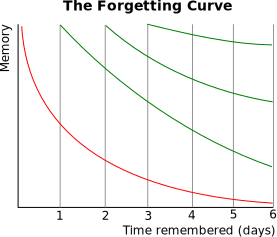

# Review Planner

This web application aims to help users plan their review schedule for learning new things. 

The concept is inspired by the [Ebbinghaus Forgetting Curve](https://en.wikipedia.org/wiki/Forgetting_curve), which suggests that repetition is the key to retaining newly learned information.

Without repetition, we forget things quickly: \

With some repetition, the curve looks a lot better: \

(Images are from [Wikipedia](https://en.wikipedia.org/wiki/Forgetting_curve))

